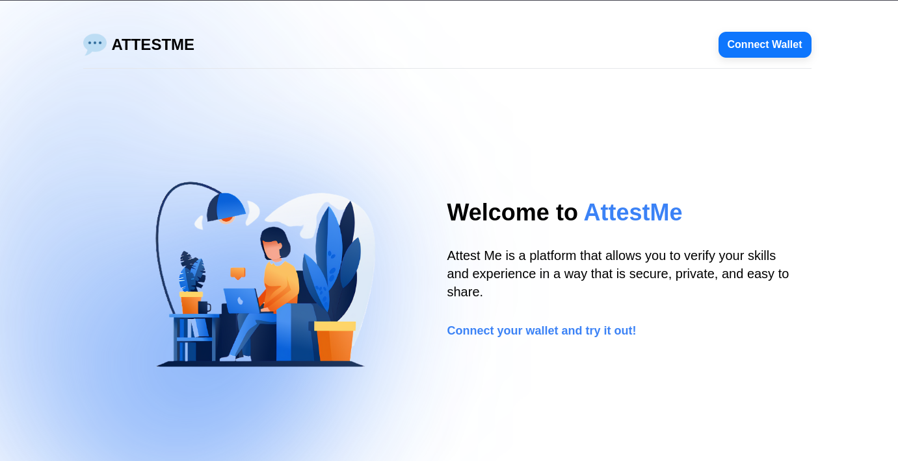
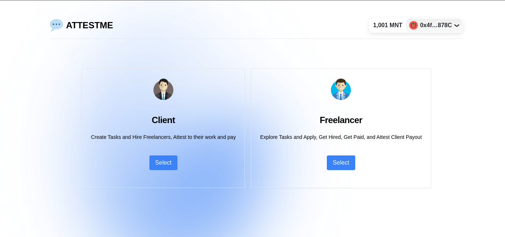

# AttestMe - The game-changing solution for the future of task marketplaces ✅

## Intro to AttestMe 💯

🪐 Welcome to AttestMe where reputation and trust takes the center stage. It ensures the fairness, transparency, and excellence in every task.

## Project Description 🌟

### 🗂️ Problem Statement

💡 There’s no way for clients to identify if the freelancers are competent in completing their jobs in the space. The clients also don't know if they can trust certain clients due to unverified payments.

💡 There’s currently not a reliable Web3 Job Marketplace available in the space. In Web3, employers who look out for freelancers to perform micro tasks / gigs, usually utilises Twitter and Discord for reachouts. These gigs typically include: Website Development, Discord Server Moderation, Smart Contract Audits and Community Management.

### Get Started
url

### Solution ⚙️

🔹 Task givers may click the **'Attest'** button associated with a post, indicating their formal endorsement of the freelancer's satisfactory completion of the task.

🔹 Attesting to posts serves as a concrete affirmation by task givers that the freelancer has executed the task with excellence and met their expectations.

### 🔥 Value Proposition 🔥

**👍🏼 Task completion attestation**

This pivotal feature empowers clients to provide professional endorsements upon task completion. These endorsements manifest as visible counters on the freelancer's profile, creating a robust **'Reputation System'**.
Enhanced reputation opens doors to improved job-seeking opportunities, forging a stronger connection between skills and success in the dynamic freelancing ecosystem.
Most importantly, harmonising the Web3 Space, helping each other out with job opportunities to climb up the ladder of reputation.

**💰 Client Payout attestation**

This feature empowers freelancers to vouch for clients upon receiving payment for successfully completed tasks. These endorsements are showcased as counters on clients' profiles, contributing to the augmentation of their reputation. This, in turn, fosters a heightened level of trust among freelancers, as they perceive clients who consistently fulfill their financial commitments as reliable partners within our platform's ecosystem.

### 📎 Features Utilisation

If you are a Client, you may:
1. Create posts for job details and extend job opportunities.
2. Attest the completed task by clicking the **"Attest"** button.
3. Transfer funds to freelancers upon task completion.

💎 For clients, the count of attestations signifies the quantity of verified payments they have issued.

If you are a Freelancer, you may:
1. Select tasks through the dashboard with the **"Interested"** button.
2. Select the **"Complete Task"** button upon successful task fulfillment.
3. Confirm 'payment received' from the client by utilizing the **"Attest"** button.

💎 For freelancers, the quantity of attestations serves as a reflection of the number of successfully completed jobs.

### **Tech Stack ⚙️**

- Package-Manager: `yarn`
- Smart Contract Development: `foundry` `solidity`
  - Deploy: `forge script`
  - Typescript-Types: `typechain`
  - SDK: `openzeppelin` `ethers`
  - Network: `linea-goerli` `taiko-grímsvötn`
- Frontend: `next`, `react`
  - Contract Interactions: `wagmi`, `rainbowkit`
  - Styling: `tailwindcss`
- Backend: `Kepler`
- Misc:
  - Linting & Formatting: `eslint`, `prettier`
  - Design: `excalidraw`

#### **Deployments ⛓️**

- Linea 

- Taiko 

#### **License 📄**

This project operates under the MIT License, giving you the freedom to build upon our vision.

#### **Explore**
Embrace the reality of task marketplaces with AttestMe. Say hello to the availability of task mutualism with the ability to hire or take tasks.

If you have any feedbacks, feel free to drop them on GitHub!